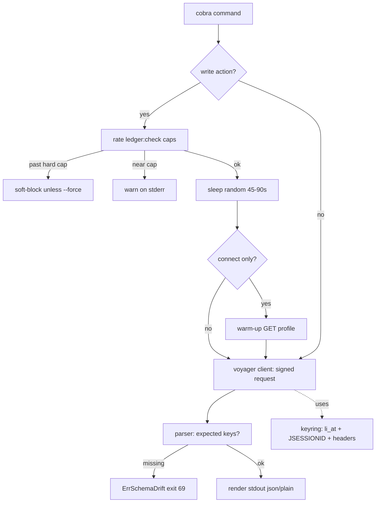

# feat: li — free lightweight LinkedIn CLI over Voyager

## Summary

Build `li`, a single static Go binary that drives LinkedIn from the terminal via the internal
Voyager API using the user's own session cookies. gogcli-shaped: `--json` / `--plain` TSV output,
data on stdout / human text on stderr, sysexit exit codes, OS-keyring credential storage. Eight
commands (`login who search jobs connect msg post inbox`) plus a `doctor` drift-check command.
Ban-safety without a browser: auto-jitter on writes, a local JSON rate ledger, real-browser header
cloning, and one warm-up GET before `connect`, with a warn + soft-block posture.

The defining constraint is durability: Voyager endpoints are undocumented and drift — several in the
reference map are already stale. The endpoint set is therefore an isolated, version-pinned module,
verified against a live account during build, and **fails loud** on schema drift (no silent
fallback, no fabricated output).

---

## Problem Frame

No existing option is simultaneously free, lightweight, fast, and working. Official OAuth is gated
(no people search, no arbitrary profile read, no messaging on free tier); paid cloud wrappers cost
money; browser-automation tools drag in Chrome and are slow and fat. The free+working path is the
Voyager internal API with cookie auth — but it carries ToS/ban risk and endpoint drift. `li` takes
that path deliberately, mitigating ban risk with cheap pacing rather than browser-grade stealth.

See origin: `docs/brainstorms/2026-06-27-li-linkedin-cli-requirements.md`.

---

## Key Technical Decisions

- **Language/build:** Go, single static binary (`CGO_ENABLED=0`). Instant startup, no runtime deps.
  (see origin: lightweight + fast constraints)
- **CLI framework:** `spf13/cobra` for the subcommand tree. One dependency; the 8+command surface
  justifies it over hand-rolled `flag`. (confirmed call-out)
- **Credential storage:** OS keyring via `zalando/go-keyring` (macOS Keychain / Secret Service /
  Credential Manager). Cookies never written to plaintext disk.
- **Rate ledger:** flat JSON file in the config dir, not SQLite. Single-user action counts don't
  need SQL; keeps the binary dep-free on the storage side. (confirmed call-out)
- **Endpoints as a pinned module:** all Voyager paths/params live in one `internal/voyager`
  package, tagged with a `schemaVersion`. Drift is contained to one file and surfaced by `doctor`.
- **Fail-loud on drift:** when a response is missing expected keys, the parser returns a typed
  `ErrSchemaDrift` (exit code for transient/contract failure) — never a partial/empty/fabricated
  result. (see origin: no silent fallback)
- **Output contract (gogcli model):** stdout = machine data (`--json` or `--plain` TSV, stable
  keys/field order); stderr = human prose, warnings, jitter notices, progress.
- **Header fidelity:** the real browser User-Agent + Voyager headers (`x-restli-protocol-version:
  2.0.0`, `x-li-lang`, `accept-language`) are sent on every call; `csrf-token` is derived from the
  `JSESSIONID` cookie value (quotes stripped). Captured/refreshed at `login`.

### Endpoint reference (extracted, treat as drift-prone — verify live in U2)

Base: `https://www.linkedin.com/voyager/api`

| Op | Method | Path (reference) | Drift note |
|----|--------|------------------|-----------|
| profile | GET | `/identity/profiles/{publicId}/profileView` | stable-ish |
| people search | GET/POST | `/graphql?queryId=voyagerSearchDashClusters…` | **`/search/blended` deprecated → GraphQL now** |
| job search | GET | `/voyagerJobsDashJobCards` / `/jobs/jobPostings` | GraphQL-migrated; verify |
| connect | POST | `/growth/normInvitations` (or `/voyagerRelationshipsDash…`) | **commented out in ref fork — verify** |
| message | POST | `/messaging/conversations/{urn}/events` (new convo: `/messaging/conversations`) | stable-ish |
| inbox | GET | `/messaging/conversations` | stable-ish |
| post | POST | `/contentcreation/normShares` (or GraphQL) | **not in ref fork — verify** |

---

## High-Level Technical Design



Exit codes (sysexits-style): `0` ok · `64` usage · `69` schema drift / contract failure ·
`75` rate soft-block · `77` auth missing/expired.

---

## Output Structure

```
li/
├── main.go
├── go.mod
├── cmd/
│   ├── root.go          # cobra root, global --json/--plain flags, output writer
│   ├── login.go
│   ├── who.go
│   ├── search.go
│   ├── jobs.go
│   ├── connect.go
│   ├── msg.go
│   ├── post.go
│   ├── inbox.go
│   └── doctor.go
├── internal/
│   ├── auth/            # keyring store, cookie+header capture, csrf derivation
│   ├── voyager/         # client (signed requests), endpoints.go (pinned paths), parsers
│   ├── safety/          # ledger.go (JSON store, caps), jitter.go, warmup
│   └── output/          # json + plain TSV renderers, stderr human writer, exit codes
└── docs/
    ├── brainstorms/
    └── plans/
```

Tree is a scope declaration, not a constraint — implementer may adjust.

---

## Implementation Units

### U1. Project scaffold + output contract

**Goal:** Buildable cobra skeleton with the global output/exit-code contract in place.
**Requirements:** single binary, gogcli output shape, intuitive CLI. (R: output contract, simple)
**Dependencies:** none.
**Files:** `main.go`, `go.mod`, `cmd/root.go`, `internal/output/render.go`,
`internal/output/exit.go`, `internal/output/render_test.go`.
**Approach:** cobra root with persistent `--json` / `--plain` flags (mutually exclusive; default
human). `output` package exposes `Data(v any)` → stdout (json or TSV), `Human(msg)` → stderr,
`Die(code, err)` mapping typed errors to sysexit codes. Non-TTY auto-selects `--json`.
**Patterns to follow:** gogcli stdout/stderr split; sysexits exit-code table above.
**Test scenarios:**
- `Data` with `--json` emits stable-key JSON to stdout, nothing to stderr.
- `Data` with `--plain` emits tab-separated rows, no header decoration.
- Non-TTY stdout with no flag defaults to JSON.
- `Die(ErrAuth)` returns exit 77; `Die(ErrSchemaDrift)` returns 69; `Die(ErrRateBlock)` returns 75.
- `--json` and `--plain` together → usage error, exit 64.
**Verification:** `go build` produces a single binary; `li --help` lists subcommands; output flags
route to correct streams.

### U2. Voyager client + pinned endpoints + live verification

**Goal:** Signed HTTP client hitting Voyager with correct headers, plus the pinned endpoint module
verified against a real account.
**Requirements:** free Voyager path, header fidelity, fail-loud on drift. (R: engine, durability)
**Dependencies:** U1.
**Files:** `internal/voyager/client.go`, `internal/voyager/endpoints.go`,
`internal/voyager/errors.go`, `internal/voyager/client_test.go`.
**Approach:** `Client` wraps `http.Client` with a cookie jar (li_at + JSESSIONID), injects the
header set (UA, `x-restli-protocol-version: 2.0.0`, `x-li-lang`, `accept-language`) and `csrf-token`
derived from JSESSIONID. `endpoints.go` holds every path + `schemaVersion` const. `errors.go`
defines `ErrSchemaDrift`, `ErrAuth`. **Execution note: during this unit, hit each endpoint once
against a throwaway live account to confirm current paths** (the reference map is partly stale —
`/search/blended`, invite, and post endpoints need confirmation) and pin the working versions.
**Patterns to follow:** nsandman/tomquirk `linkedin-api` client (csrf from JSESSIONID, base URL,
header set) — mirror, don't depend.
**Test scenarios:**
- csrf-token equals JSESSIONID value with surrounding quotes stripped.
- All required headers present on a built request (table-driven assert against a stub server).
- 401/403 response → `ErrAuth`.
- Response missing an expected top-level key → `ErrSchemaDrift` (against recorded fixture).
- Cookie jar carries li_at + JSESSIONID on every request.
**Verification:** against a live throwaway account, a raw `profileView` fetch returns parseable JSON;
endpoint constants reflect verified current paths.

### U3. Auth: login + keyring store + header capture

**Goal:** `li login` captures cookies + session headers and stores them in the OS keyring.
**Requirements:** cookie auth, no plaintext secrets, intuitive setup. (F: login)
**Dependencies:** U1, U2.
**Files:** `cmd/login.go`, `internal/auth/store.go`, `internal/auth/store_test.go`.
**Approach:** `li login` prompts for (or accepts via flags/stdin) `li_at` + `JSESSIONID`, validates
them with one live `profileView` call to own profile, then writes to keyring under service `li`. On
success print the resolved display name to stderr. All other commands load creds via `auth.Load()`
→ `ErrAuth` (exit 77) if missing.
**Patterns to follow:** go-keyring set/get; U2 client for the validation call.
**Test scenarios:**
- Valid cookies → stored in keyring, success message to stderr, exit 0.
- Invalid/expired cookies (validation call 401) → `ErrAuth`, nothing stored, exit 77.
- `auth.Load()` with empty keyring → `ErrAuth`.
- Cookies accepted from stdin (non-interactive) as well as interactive prompt.
- Stored blob round-trips (set → load → identical values).
**Verification:** `li login` then `li who <self>` works without re-entering cookies.

### U4. Safety core: rate ledger + jitter + warm-up

**Goal:** Reusable ban-safety layer wrapping write actions.
**Requirements:** auto-jitter, local rate ledger, warn+soft-block, warm-up before connect.
(R: ban-safety design)
**Dependencies:** U1.
**Files:** `internal/safety/ledger.go`, `internal/safety/jitter.go`,
`internal/safety/ledger_test.go`, `internal/safety/jitter_test.go`.
**Approach:** JSON ledger in config dir tracks timestamped action counts per type over rolling
day/week windows. `Guard(action, force)` returns: proceed / warn-and-proceed (≥80% of cap) /
soft-block (≥hard cap, overridable by `--force`). Hard caps default ~20% below known thresholds
(invites ~100/week is LinkedIn's cap → default lower). `Jitter()` sleeps a uniform random 45–90s,
emitting a stderr notice. `connect` path calls a warm-up GET before the invite. Ledger writes are
atomic (temp file + rename).
**Patterns to follow:** rolling-window counting; atomic file write.
**Test scenarios:**
- Under cap → `Guard` returns proceed, count incremented.
- At 80% of weekly cap → warn-and-proceed, warning text on stderr.
- At/over hard cap, no force → soft-block (`ErrRateBlock`, exit 75), count NOT incremented.
- At/over hard cap with `--force` → proceed, count incremented.
- Rolling window: actions older than the window are excluded from the count.
- Jitter sleeps within [45s,90s] (inject clock/seed to assert bounds without real sleep).
- Concurrent ledger writes don't corrupt the file (atomic-rename test).
**Verification:** simulated burst of invites warns then blocks at the cap; `--force` overrides.

### U5. Read commands: who, search, jobs, inbox

**Goal:** The four read verbs, parsing Voyager responses into stable output rows.
**Requirements:** who/search/jobs/inbox; not-token-hungry terse output. (F: read commands)
**Dependencies:** U2, U3, U1.
**Files:** `cmd/who.go`, `cmd/search.go`, `cmd/jobs.go`, `cmd/inbox.go`,
`internal/voyager/parse_profile.go`, `internal/voyager/parse_search.go`,
`internal/voyager/parse_jobs.go`, `internal/voyager/parse_messaging.go`, plus `*_test.go` parser
tests against recorded fixtures.
**Approach:** each command: load auth → call client → parse → `output.Data`. `who` returns name,
headline, current role. `search` (`--title`, `--company`) and `jobs` (`--location`) return compact
rows. `inbox` lists recent conversations (counterparty, last snippet, urn). Parsers fail loud on
missing keys (`ErrSchemaDrift`).
**Patterns to follow:** U2 client; U1 renderers; fixture-based parser tests.
**Test scenarios:**
- `who <publicId>` fixture → correct name/headline/role; `--json` keys stable.
- `search` with `--title`/`--company` builds correct query params (table-driven).
- `search` empty results → exit 0 with empty set (NOT an error), `--plain` emits zero rows.
- `jobs --location` parses job rows (title, company, location, jobId).
- `inbox` parses conversation list with counterparty + snippet.
- Any parser on a drifted fixture (missing key) → `ErrSchemaDrift`, exit 69 (no partial output).
**Verification:** against live account, each read command returns sensible rows and pipes cleanly to
`jq` / `cut`.

### U6. Write commands: connect, msg, post

**Goal:** The three write verbs, each gated through the safety layer.
**Requirements:** connect/msg/post; warm-up before connect; warn+soft-block. (F: write commands)
**Dependencies:** U2, U3, U4.
**Files:** `cmd/connect.go`, `cmd/msg.go`, `cmd/post.go`,
`internal/voyager/write_invitations.go`, `internal/voyager/write_messaging.go`,
`internal/voyager/write_share.go`, plus `*_test.go`.
**Approach:** each command: load auth → `safety.Guard` (jitter, caps) → for `connect`, warm-up GET
target profile → POST → confirm to stderr, record in ledger. `connect <id> [--note]`, `msg <id>
"text"`, `post "text"`. All write actions honor global `--force` to override soft-block.
**Patterns to follow:** U4 Guard wrapper; U2 client POST; verified endpoints from U2.
**Test scenarios:**
- `connect` under cap → warm-up GET fires before POST (assert call order against stub), invite sent,
  ledger incremented.
- `connect` at hard cap, no force → soft-block, no POST, exit 75.
- `connect --force` at cap → POST proceeds.
- `msg <id> "text"` → POST to conversation events with correct payload; new-conversation path when
  no existing thread.
- `post "text"` → POST share with commentary; success confirmation on stderr.
- Any write hitting drifted endpoint → `ErrSchemaDrift`, exit 69, ledger NOT incremented.
- Jitter notice printed to stderr before each write.
**Verification:** against throwaway account, a connect/msg/post each succeed and increment the
ledger; repeated invites warn then block.

### U7. doctor: drift + auth health check

**Goal:** `li doctor` verifies auth validity and probes each pinned endpoint for drift.
**Requirements:** durability / fail-loud, intuitive diagnostics. (R: drift handling)
**Dependencies:** U2, U3, U5.
**Files:** `cmd/doctor.go`, `internal/voyager/health.go`, `cmd/doctor_test.go`.
**Approach:** loads auth, does one lightweight call per endpoint category, reports per-endpoint
OK / DRIFT / AUTH-FAIL with the `schemaVersion`. Exits non-zero if any endpoint drifts so it's
scriptable in CI/cron against a canary account.
**Patterns to follow:** U2 client + parsers; exit-code table.
**Test scenarios:**
- All endpoints healthy (fixtures) → all OK, exit 0.
- One endpoint returns drifted shape → that row DRIFT, overall exit 69.
- Expired auth → AUTH-FAIL rows, exit 77.
- `--json` emits a machine-readable per-endpoint status table.
**Verification:** `li doctor` against a live account prints per-endpoint health; flips to drift exit
when an endpoint is intentionally mis-pinned.

---

## Scope Boundaries

**Deferred for later** (from origin): `li schema --json` runtime discovery; multi-account named
profiles; extra formatters (table/csv/yaml).

**Outside this product's identity** (from origin): MCP mode; browser automation / mouse emulation;
paid cloud or official OAuth; any LLM in the loop; volume-outreach tooling (drip campaigns, lead
lists, CRM).

**Deferred to follow-up work** (plan-local): proxy support; cookie auto-import from a local browser
profile; richer profile fields beyond name/headline/role.

---

## Risks & Dependencies

- **Endpoint drift (highest):** reference map is partly stale; U2 live verification is the
  load-bearing step. Mitigation: pinned module + `doctor` + fail-loud parsers. Plan assumes a
  throwaway account is available for U2/U5/U6 live checks.
- **Account ban (ToS):** Voyager use violates LinkedIn ToS. Mitigation: pacing layer (U4),
  throwaway-account guidance in docs. Cannot be eliminated, only reduced.
- **Header staleness:** an old hardcoded UA raises detection risk; capture real UA at `login` and
  keep the header set current.
- **GraphQL query IDs:** people search / jobs now use versioned GraphQL `queryId`s that rotate;
  treat these as the most drift-prone pins and the first thing `doctor` checks.
- **Dependencies:** `spf13/cobra`, `zalando/go-keyring`. Stdlib `net/http` for everything else.

---

## Sources & Research

- nsandman/linkedin-api (maintained tomquirk fork) — extracted base URL, header set, csrf
  derivation, and endpoint paths; confirmed several reference endpoints are already stale.
- gogcli (openclaw/gogcli) — output contract, keyring, exit-code, single-binary shape.
- bcharleson/linkedincli — confirmed Voyager + cookie model viability (MCP half excluded).
- Origin requirements: `docs/brainstorms/2026-06-27-li-linkedin-cli-requirements.md`.
