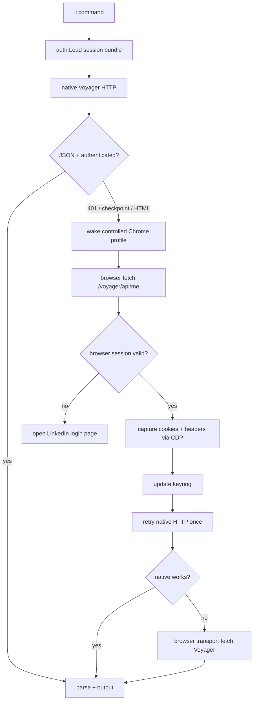

# feat: li browser-assisted auth and resilient Voyager transport

## Summary

Replace fragile Chrome cookie database replay with a `gogcli`-style auth system for `li`: one `li login` command opens a controlled Chrome session, lets the user log into LinkedIn normally, captures the live LinkedIn browser session through Chrome DevTools Protocol, validates `/voyager/api/me`, stores the minimum reusable session in the OS keyring, and falls back to browser-context Voyager fetches when native Go HTTP replay is rejected.

This is a targeted correction to the first plan's auth assumptions. The CLI stays a single Go binary and normal commands stay fast native HTTP when possible, but login and recovery become browser-assisted because live testing proved on-disk Chrome cookie replay returns `401` / `302` even while a visible Chrome tab is on LinkedIn Feed.

---

## Problem Frame

The original product goal still stands: free, lightweight LinkedIn from the terminal over Voyager, with clean stdout/stderr and keyring-backed credentials. The broken assumption is that a CLI can reliably read Chrome's on-disk cookie databases and replay those cookies from Go. Live testing in this repo disproved that: Chrome showed `https://www.linkedin.com/feed/`, but every on-disk profile either returned `401`, redirected to the same Voyager URL, or lacked a valid CSRF cookie.

The right fix is not more cookie-file guessing. The working shape should mirror `gogcli`'s auth posture: a single friendly login command, browser authorization, keyring persistence, auth status/doctor commands, and headless/manual fallbacks. The equivalent for LinkedIn is not OAuth; it is a browser-managed LinkedIn web session captured through CDP.

---

## Requirements

**User login and setup**

- R1. `li login` must be the default first-run setup command and must not require DevTools, cookie copying, Claude, Codex, or any agentic helper.
- R2. `li login` must open or reuse a controlled Chrome session and allow any LinkedIn login method, including Google SSO, passkeys, password login, and checkpoint flows.
- R3. After the user reaches an authenticated LinkedIn page, `li` must validate the session against `/voyager/api/me` before storing anything.
- R4. Login must store only credentials/session metadata needed for reuse in the OS keyring; no plaintext cookie files owned by `li`.
- R5. `li login --from-browser` may remain as a fast debug/import path, but it must not be the primary product path.

**Transport behavior**

- R6. Normal read commands should use native Go Voyager HTTP when the stored session replays cleanly.
- R7. If native Go HTTP returns auth failure, login checkpoint, or HTML interstitial, `li` must attempt session refresh through the controlled browser profile before asking the user to log in again.
- R8. If native replay still fails but browser-context `fetch` works, read commands must use browser transport for that request and preserve the same output contract.
- R9. Write commands must not silently switch to browser transport without applying the existing safety ledger, jitter, and confirmation posture.

**Operational clarity**

- R10. `li auth status` or `li doctor` must report whether native HTTP, browser refresh, and browser transport are available.
- R11. The CLI must produce crisp recovery text: "Opening LinkedIn. Log in once, then return here." is acceptable; "copy this cookie header" is debug-only.
- R12. Headless/remote environments must fail explicitly unless the user opts into a split/manual browser flow.

---

## Key Technical Decisions

- **KTD1. Browser-assisted login is the primary auth flow.** Cookie DB import looked clever but failed live. A controlled Chrome session lets LinkedIn perform its own login, Google SSO, checkpoint, and cookie mutation in the environment it expects.
- **KTD2. Use Chrome DevTools Protocol, not Selenium/Playwright.** CDP gives the exact primitives needed: launch/connect, navigate, read cookies, evaluate same-origin `fetch`, and observe network responses. It avoids bundling a browser or adding a heavy automation runtime.
- **KTD3. Keep native Go HTTP as the default command transport.** The CLI remains fast after login. Browser transport is a fallback for auth-hostile cases, not the hot path for every request.
- **KTD4. Store a reusable session bundle, not raw "whatever Chrome had."** Keyring should hold `li_at`, `JSESSIONID`, a compact safe cookie header, browser profile metadata, user-agent/client hints, and a timestamp. The controlled browser profile on disk is the refresh source, not the keyring's replacement.
- **KTD5. `li login` owns profile creation.** Use a dedicated `li` Chrome user-data-dir under the user config/state directory. Do not depend on the user's daily Chrome profiles; live testing showed those are stale, locked, or not equivalent to the running tab.
- **KTD6. Browser transport must be a first-class client interface.** Commands should call a Voyager transport abstraction so native HTTP and browser-context fetch can share request/response parsing and output behavior.

---

## High-Level Technical Design

The login flow is the same pipeline starting at `LOGIN`: launch controlled Chrome, wait for the user to authenticate, validate with browser-context `/voyager/api/me`, capture session, store, then run one native validation attempt.

---

## Implementation Units

### U1. Session bundle and transport boundary

- **Goal:** Replace raw cookie assumptions with a session model and a transport interface that can support native HTTP and browser-context fetch.
- **Files:** `internal/voyager/client.go`, `internal/voyager/client_test.go`, `internal/auth/store.go`, `internal/auth/store_test.go`, `cmd/helpers.go`.
- **Approach:** Define a `Session` / `Creds` shape that can carry cookies, CSRF, user-agent, captured-at time, and optional browser profile metadata. Introduce a small Voyager transport interface with methods equivalent to `GetRaw` and `PostRaw`. Keep the existing native client as one implementation.
- **Patterns to follow:** Existing `voyager.Client`, `auth.Save` / `auth.Load`, and `cmd.authedClient`.
- **Test scenarios:**
  - Stored session round-trips with compact cookies and browser metadata.
  - Missing `li_at` remains `ErrAuth`.
  - Native transport still sends `csrf-token`, Rest.li headers, and cookies.
  - A command using the transport abstraction behaves the same with a stub native transport.
- **Verification:** Existing read-command tests still pass with the transport abstraction in place.

### U2. Controlled Chrome profile manager

- **Goal:** Add a small CDP-backed browser manager that launches or attaches to a dedicated `li` Chrome profile.
- **Files:** `internal/browser/chrome.go`, `internal/browser/chrome_test.go`, `go.mod`, `go.sum`.
- **Approach:** Launch installed Chrome with `--remote-debugging-port=0`, a stable `--user-data-dir` under the app config/state directory, and a LinkedIn start URL. Read the `DevToolsActivePort` file to discover the WebSocket endpoint. Keep this package narrow: launch, connect, navigate, evaluate JavaScript, read cookies, close.
- **Patterns to follow:** Current preference for one binary and no bundled browser. CDP package should be a library dependency only, not a runtime service.
- **Test scenarios:**
  - Chrome command construction uses a dedicated user-data-dir and remote debugging.
  - Missing Chrome executable returns a clear setup error.
  - `DevToolsActivePort` timeout returns a clear diagnostic.
  - Browser manager can be faked behind an interface for login tests.
- **Verification:** On macOS, `li login --browser` opens a Chrome window controlled by `li`.

### U3. Browser-assisted `li login`

- **Goal:** Make `li login` the no-friction first-run path.
- **Files:** `cmd/login.go`, `cmd/login_test.go`, `internal/auth/browser_login.go`, `internal/auth/browser_login_test.go`, `internal/voyager/me.go`.
- **Approach:** Change the default login path to browser-assisted login. Open LinkedIn Feed in the controlled profile, poll browser-context `fetch('/voyager/api/me', {credentials: 'include'})`, and once it returns authenticated JSON, capture cookies and user-agent through CDP. Store the session in keyring. Keep `--from-browser`, `--li-at`, `--cookie`, and `--jsessionid` as advanced/debug paths.
- **Patterns to follow:** `gog auth add` style: open browser, complete login, store durable credential, then verify with status/doctor.
- **Test scenarios:**
  - Authenticated browser fetch stores session and prints a success message.
  - Login page/checkpoint keeps waiting with human-facing stderr guidance.
  - Timeout exits with `ErrAuth` and no stored credentials.
  - Google SSO requires no special code; the test should model it as "browser eventually becomes authenticated."
  - Manual/debug flags still bypass browser-assisted login.
- **Verification:** Fresh machine UX is `li login`, browser opens, user logs in, `li who <publicId>` works.

### U4. Session refresh and native retry

- **Goal:** Recover automatically when stored cookies stop replaying natively.
- **Files:** `internal/auth/refresh.go`, `internal/auth/refresh_test.go`, `internal/voyager/client.go`, `cmd/helpers.go`.
- **Approach:** On native auth failure, open the controlled Chrome profile in the background/visible window, validate `/voyager/api/me` in browser context, capture updated cookies, save them, and retry native HTTP once. Avoid infinite retry loops.
- **Patterns to follow:** Existing `ErrAuth` mapping and `doctor` health reporting.
- **Test scenarios:**
  - Native `401` triggers one browser refresh and one native retry.
  - Browser refresh failure returns `ErrAuth` with "run `li login`" guidance.
  - Refreshed cookies are saved only after browser validation succeeds.
  - Retry loop cannot recurse indefinitely.
- **Verification:** Delete/expire stored `JSESSIONID`, keep the controlled browser logged in, then a read command refreshes and succeeds.

### U5. Browser transport fallback

- **Goal:** Keep commands working when LinkedIn rejects native replay but accepts same-origin browser requests.
- **Files:** `internal/voyager/browser_transport.go`, `internal/voyager/browser_transport_test.go`, `cmd/helpers.go`, `cmd/who.go`, `cmd/search.go`, `cmd/inbox.go`, `cmd/jobs.go`.
- **Approach:** Implement a transport that runs same-origin `fetch('/voyager/api/...')` inside the controlled LinkedIn tab via CDP. Return raw bytes to existing parsers. Use this only after native retry fails or when the user passes an explicit debug flag such as `--transport=browser`.
- **Patterns to follow:** Current parser/output split; transport returns bytes, parsers stay transport-agnostic.
- **Test scenarios:**
  - Browser transport maps status `401` / checkpoint HTML to `ErrAuth`.
  - Browser transport returns raw JSON bytes that existing parsers consume.
  - Read commands can select native, auto, or browser transport.
  - Write commands require safety guard before browser transport POSTs.
- **Verification:** With a logged-in controlled Chrome profile, `li who <publicId> --transport=browser --json` succeeds even if native replay fails.

### U6. Auth status, doctor, and recovery UX

- **Goal:** Make auth state understandable without exposing cookies.
- **Files:** `cmd/doctor.go`, `internal/voyager/health.go`, `cmd/auth.go` or `cmd/login.go`, `cmd/*_test.go`.
- **Approach:** Add `li auth status` or extend `li doctor` to report keyring presence, controlled Chrome profile presence, native `/me`, browser `/me`, and selected transport mode. Output human text to stderr and machine status to JSON/TSV as existing output rules require.
- **Patterns to follow:** Existing `doctor` report shape and `output.Tabular`.
- **Test scenarios:**
  - No keyring entry reports auth missing.
  - Keyring present but native fails and browser succeeds reports refresh available.
  - Both native and browser fail reports login required.
  - JSON output is stable and redacts secrets.
- **Verification:** `li doctor --json` explains whether native, refresh, and browser transport are healthy.

### U7. Documentation and debug escape hatches

- **Goal:** Document the user path and keep power-user paths available without making them the product.
- **Files:** `README.md` if present, `docs/usage/auth.md`, `cmd/login.go`, `cmd/root.go`.
- **Approach:** Document `li login` as the default, `li login --from-browser` as best-effort import, and `li login --manual` / existing cookie flags as debug-only. Explain that Google SSO works only as an interactive LinkedIn browser login, not as a Voyager credential.
- **Patterns to follow:** Existing terse CLI help style.
- **Test scenarios:**
  - `li login --help` labels manual cookie flags as advanced/debug.
  - Non-interactive mode never opens a browser and returns a clear error if no stored session exists.
  - Docs state no cookie paste is required for normal users.
- **Verification:** A new user can follow the docs from install to `li who` without DevTools.

---

## Scope Boundaries

**In scope**

- Browser-assisted login via a controlled Chrome profile.
- CDP cookie/session capture from LinkedIn's authenticated browser context.
- Native HTTP as preferred transport after login.
- Browser-context `fetch` as fallback when native replay fails.
- Keyring-backed session storage and auth diagnostics.

**Out of scope**

- Google OAuth tokens as Voyager credentials. Google SSO is only an interactive way to log into LinkedIn in the browser.
- Full Selenium/Playwright-style browsing for every command.
- Bulk outreach, campaigns, CRM sync, or evasion tooling.
- Supporting every browser in v1. Chrome is enough for the durable path; cookie DB import can remain best-effort.

---

## Acceptance Examples

- AE1. Fresh user login:
  - **Given:** The user has Chrome installed and no `li` keyring entry.
  - **When:** The user runs `li login`, logs into LinkedIn in the opened browser, and returns to the terminal.
  - **Then:** `li` validates `/voyager/api/me`, stores the session, and `li who <publicId> --json` works.

- AE2. Google SSO login:
  - **Given:** The user logs into LinkedIn through "Continue with Google."
  - **When:** LinkedIn finishes browser login and reaches Feed.
  - **Then:** `li` captures LinkedIn cookies, not Google tokens, and validates Voyager.

- AE3. Native replay rejected:
  - **Given:** Stored cookies return `401` from native Go HTTP but the controlled browser profile is still logged in.
  - **When:** The user runs `li who <publicId>`.
  - **Then:** `li` refreshes through Chrome, retries native once, and if needed uses browser transport.

- AE4. Browser session expired:
  - **Given:** Native and browser-context `/me` both fail.
  - **When:** The user runs a command.
  - **Then:** `li` opens LinkedIn login and asks the user to log in once; it does not ask for a cookie header.

- AE5. Headless mode:
  - **Given:** No GUI Chrome is available.
  - **When:** The user runs `li login`.
  - **Then:** `li` exits with a clear headless error and points to a manual/split login flow.

---

## Risks & Dependencies

- **LinkedIn may harden Voyager further.** Browser transport gives the best fallback short of abandoning the lightweight CLI, but it is still unofficial and can break.
- **CDP dependency choice matters.** Prefer a narrow Go CDP library or a small local CDP wrapper. Do not pull in a framework that silently turns the product into a browser automation stack.
- **Chrome install detection is platform-specific.** Start with macOS because this repo is currently developed there, but isolate executable discovery by platform.
- **Controlled profile storage must be clear.** The browser profile is a local session cache. It should live under app state/config and be removable by `li auth remove` or similar.
- **Write actions need extra caution.** Browser transport for POSTs must never bypass jitter, rate ledger, warm-up, or explicit user intent.

---

## Sources / Research

- `docs/brainstorms/2026-06-27-li-linkedin-cli-requirements.md` — original product goals, constraints, output contract, and ban-safety posture.
- `docs/plans/2026-06-27-001-feat-li-linkedin-cli-plan.md` — existing v1 architecture, now stale specifically around cookie-only login.
- `cmd/login.go`, `internal/auth/browser.go`, `internal/voyager/client.go` — current implementation that live-tested cookie DB import and native replay.
- `gogcli` auth docs: `gog auth add`, `gog auth doctor`, keyring, import, status, and browser/account management patterns: https://github.com/openclaw/gogcli/blob/main/docs/commands/gog-auth.md
- `gogcli` quickstart: browser auth, OS keyring persistence, verification via `gog auth list --check` and `gog auth doctor --check`: https://gogcli.sh/quickstart.html

