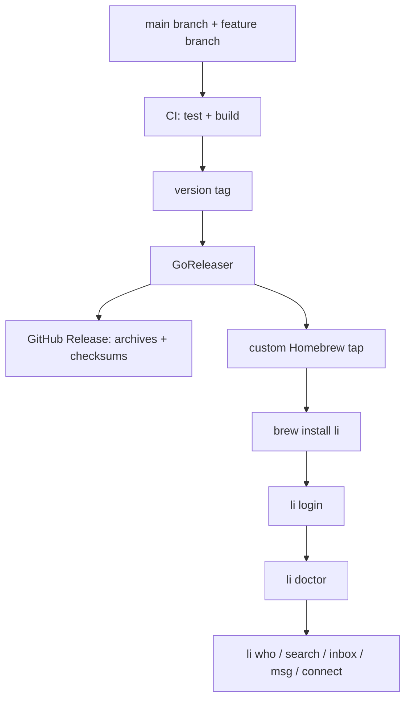

# feat: GitHub and Homebrew release for li

## Summary

Prepare `li` for a public GitHub release and a first-class Homebrew install path. The release should make the street-smart user path obvious: install, run `li login`, validate with `li doctor`, and use the existing read/write commands without needing Codex, Claude, DevTools, cookie copying, or private setup notes.

This plan is macOS/Homebrew-first because that is the practical first public channel for the current Chrome/keyring login flow. Linux and Windows binaries can ship as GitHub artifacts, but they should not block the initial Homebrew release.

---

## Problem Frame

The code now contains the hard product work: browser-assisted LinkedIn login, OS keyring persistence, native Voyager HTTP, browser fallback transport, drift checks, and write safety. The repo is not yet something a new user can discover, trust, install, and operate. There is no README, license, release workflow, version command, Homebrew tap configuration, or maintainer release runbook.

The goal is to package the existing product honestly. This is an unofficial personal LinkedIn CLI over Voyager, not a safe outreach platform. Public docs and release automation need to say that plainly while still making the happy path feel as clean as `gogcli`: one install command, one login command, one doctor command, then normal CLI use.

See origin: `docs/brainstorms/2026-06-27-li-linkedin-cli-requirements.md`.

---

## Requirements

**Public install path**

- R1. A new macOS user can install `li` through Homebrew from a custom tap and run the binary without building from source.
- R2. GitHub Releases must publish checksummed archives for the supported release targets.
- R3. The binary must expose version metadata so users and bug reports can identify the exact release.
- R4. The Homebrew package must include a formula or cask test that proves the installed binary starts and reports version/help output.

**GitHub readiness**

- R5. The repo must have a README that explains what `li` is, how to install it, how to log in, how to verify auth, and how to troubleshoot.
- R6. The repo must include a license, changelog or release-notes entry point, and a maintainer release runbook.
- R7. CI must run tests and builds on every push or pull request before release automation is trusted.
- R8. Release automation must be reproducible from a tag and must not require hand-editing checksums.

**User trust and safety**

- R9. Docs must state that `li` is unofficial, uses LinkedIn Voyager, may violate LinkedIn ToS, and can put accounts at risk.
- R10. Docs must keep browser-assisted `li login` as the normal path and demote cookie/manual flags to debug or recovery paths.
- R11. Docs must state what is stored: LinkedIn session material in OS keyring and a controlled Chrome profile, not Google credentials.
- R12. The release gate must include one fresh live first-run smoke check before tagging.

---

## Key Technical Decisions

- KTD1. **Custom Homebrew tap first:** Release through a user-owned tap such as `oyaah/homebrew-tap` before attempting Homebrew core. Core is the wrong first move for an unofficial Voyager CLI, and tap release can be automated immediately.
- KTD2. **GoReleaser owns artifacts and tap updates:** Use GoReleaser to build archives, checksums, GitHub Releases, and the tap formula/cask update from a tag. Hand-rolled checksum updates are exactly the kind of release footgun Homebrew users should not inherit.
- KTD3. **Formula over core submission for v1:** A custom tap formula that installs the prebuilt `li` binary is enough. Homebrew core review is deferred until the project has stable public demand and a cleaner policy story.
- KTD4. **Version metadata via ldflags:** Add package-level version fields wired into `li version` and populated by release builds. Local builds can report `dev`.
- KTD5. **README mirrors gogcli's user-first shape:** Lead with install and quickstart, then command examples, auth, output modes, doctor, troubleshooting, and risk. Do not bury setup under implementation internals.
- KTD6. **MacOS-first support posture:** The first release optimizes for macOS with Chrome and Keychain because that is the path live-tested here. Linux/Windows artifacts can exist, but docs should label their auth/keyring paths as less-tested until verified.

---

## High-Level Technical Design

The release gate should treat installation as a user flow, not just a build artifact. A passing release means an installed binary reports version, opens the documented auth path, and passes `doctor` against a real account before tagging.

---

## Scope Boundaries

### In Scope

- Public README and usage docs for install, auth, commands, output modes, safety, and troubleshooting.
- License, changelog or release notes, and maintainer release documentation.
- CI for tests and builds.
- GoReleaser configuration for GitHub artifacts and Homebrew tap updates.
- `li version` support and release-time version injection.
- A custom Homebrew tap strategy and local validation workflow.
- A live release-smoke checklist that covers login, doctor, and read-only commands.

### Deferred to Follow-Up Work

- Homebrew core submission.
- Linux package managers beyond downloadable archives.
- Windows package managers such as Scoop or WinGet.
- Full cross-platform auth certification.
- Signed/notarized macOS artifacts unless GoReleaser signing credentials are already available.
- New LinkedIn product commands beyond the current CLI surface.

### Outside This Product's Identity

- Marketing `li` as safe automation, scraping infrastructure, or volume outreach.
- Browser automation as the primary command transport.
- Official OAuth or paid LinkedIn wrapper integration.
- Any release story that requires users to paste cookies as the normal setup path.

---

## Implementation Units

### U1. Version command and release metadata

**Goal:** Add a visible version contract that works for local builds and tagged releases.

**Requirements:** R2, R3, R4.

**Dependencies:** None.

**Files:** `cmd/version.go`, `cmd/root.go`, `cmd/version_test.go`, `main.go`, `.goreleaser.yml`.

**Approach:** Add a `li version` command that reports version, commit, date, and schema version. Default values should be `dev` for local builds. Release builds should set these through ldflags. Keep output compatible with existing `--json` and `--plain` behavior where practical.

**Patterns to follow:** Existing Cobra command registration in `cmd/*.go`, output handling in `internal/output`, and schema version in `internal/voyager/endpoints.go`.

**Test scenarios:**

- Running `version` with default build metadata reports `dev` without error.
- `version --json` emits stable keys for version, commit, date, and schema version.
- `version --plain` emits TSV-compatible values without human prose on stdout.
- Injected metadata values appear in command output.

**Verification:** The built binary can run `li version`, and release config references the same metadata variables.

### U2. GitHub-ready project documentation

**Goal:** Make the repo understandable and credible to a new user landing on GitHub.

**Requirements:** R5, R6, R9, R10, R11.

**Dependencies:** U1 for version references.

**Files:** `README.md`, `LICENSE`, `CHANGELOG.md`, `docs/usage/auth.md`, `docs/usage/release.md`.

**Approach:** Write a quickstart-first README: what `li` is, risk warning, install options, `li login`, `li doctor`, common commands, output modes, write safety, troubleshooting, and privacy/storage notes. Link to `docs/usage/auth.md` for auth recovery paths and create a maintainer release doc. Add a license before pushing public code.

**Patterns to follow:** The brainstorm's `gogcli`-style output contract, `docs/usage/auth.md`, and the existing command help text.

**Test scenarios:**

- README quickstart contains a path from install to `li doctor` to `li who`.
- README names the ToS/account-risk warning before write-command examples.
- README keeps `li login` as the normal path and labels manual cookie paths as debug/recovery.
- Release doc describes the tag-driven release flow and tap validation.

**Verification:** A new user can follow the README without reading internal docs or this plan.

### U3. CI for tests and builds

**Goal:** Add a GitHub Actions baseline that protects the public repo and release branch.

**Requirements:** R7, R8.

**Dependencies:** U1.

**Files:** `.github/workflows/ci.yml`, `.github/workflows/release.yml`, `go.mod`, `go.sum`.

**Approach:** Add CI that checks out the repo, sets up Go, runs the full Go test suite, and builds the binary. Add a tag-triggered release workflow that runs GoReleaser with the required GitHub permissions. Keep release workflow inert until a tag is pushed.

**Patterns to follow:** Existing local verification command from project memory: `go test ./...` and `go build -o ./li .`.

**Test scenarios:**

- CI workflow is valid YAML and runs tests/build on pull requests and pushes.
- Release workflow triggers only for version tags.
- Release workflow has the permissions needed to create GitHub Releases and update the tap.
- Local `go test ./...` and `go build -o ./li .` still pass.

**Verification:** `gh workflow` validation or local YAML review confirms workflows are syntactically valid; local Go checks pass.

### U4. GoReleaser and Homebrew tap packaging

**Goal:** Generate GitHub release artifacts and a Homebrew install path from the same tag.

**Requirements:** R1, R2, R4, R8.

**Dependencies:** U1, U3.

**Files:** `.goreleaser.yml`, `.gitignore`, `docs/usage/release.md`.

**Approach:** Configure GoReleaser for `darwin`, `linux`, and `windows` archives where practical, with `amd64` and `arm64` targets. Configure checksum generation and Homebrew tap publishing to a custom tap repository. Include a Homebrew test that runs `li version` or `li --help`. Keep tap repository credentials documented as a maintainer prerequisite, not hardcoded.

**Patterns to follow:** GoReleaser Homebrew publishing docs and Homebrew's formula test convention.

**Test scenarios:**

- Snapshot release generation produces archives and checksums under `dist/`.
- Generated Homebrew formula/cask installs the `li` binary name.
- Homebrew package test invokes a non-network command.
- Release config does not embed secrets.

**Verification:** A local snapshot release succeeds and `brew install --build-from-source` or formula audit/test succeeds against the generated tap artifact when a tap checkout is available.

### U5. First-run and live release smoke checklist

**Goal:** Define and run the checks that prove this works for real users, not just for the developer checkout.

**Requirements:** R1, R10, R11, R12.

**Dependencies:** U2, U4.

**Files:** `docs/usage/release.md`, `docs/usage/auth.md`, `README.md`.

**Approach:** Add a maintainer checklist that starts from a clean install location: install via Homebrew, run `li version`, run `li login`, validate `li doctor --json`, and run read-only commands. Write actions should be tested only when deliberately opted in because they create real LinkedIn side effects.

**Patterns to follow:** Current `li doctor --json` schema probe behavior and existing auth recovery docs.

**Test scenarios:**

- Clean install binary can run `li version` and `li --help` without credentials.
- Fresh `li login` stores a session through browser-assisted auth.
- `li doctor --json` reports all probes as OK against a live account.
- `li who <known-public-id> --json` returns profile JSON.
- `li search <query> --json` completes and does not silently parse login pages as empty success.
- Optional write smoke tests are clearly marked as side-effecting.

**Verification:** The release checklist records date, platform, install method, binary version, and live smoke result before a public tag is cut.

### U6. GitHub publication and push hygiene

**Goal:** Make the local repo pushable and understandable on GitHub without leaking scratch artifacts.

**Requirements:** R5, R6, R7, R8, R9.

**Dependencies:** U2, U3, U4.

**Files:** `.gitignore`, `.github/workflows/ci.yml`, `.github/workflows/release.yml`, `README.md`, `LICENSE`, `CHANGELOG.md`, `docs/usage/release.md`.

**Approach:** Ensure scratch directories and local binaries are ignored, decide the public remote, push the feature branch, and prepare a PR or main branch release path. Do not include `.supermemory`, local `li` binaries, controlled Chrome profiles, or probe scratch in the public commit. If no GitHub remote exists, create or add one before pushing.

**Patterns to follow:** Existing `.gitignore` treatment of `dist/` and local state.

**Test scenarios:**

- `git status --short` contains only intentional source/docs/release files before staging.
- README links resolve to repo-relative docs.
- No local secrets, browser profiles, generated archives, or scratch probes are staged.
- GitHub remote is configured before release workflow references repository names.

**Verification:** The branch pushes to GitHub, CI starts, and the repo landing page renders the README.

---

## Risks & Dependencies

- **GitHub remote is currently missing.** Release execution must create or add the intended remote before pushing or configuring GoReleaser tap ownership.
- **Homebrew tap ownership must be decided.** The plan assumes a custom tap controlled by the maintainer, such as `oyaah/homebrew-tap`.
- **Voyager drift can break public users.** `doctor` must stay prominent in README and release smoke tests.
- **Chrome/keyring setup is platform-sensitive.** The first release should not overclaim Linux/Windows parity before those paths are live-tested.
- **LinkedIn account risk is real.** Public docs must be blunt enough that users understand this is unofficial and personally risky.
- **Go version `1.24.0` may be ahead of common CI runners.** Implementation should verify GitHub Actions can install it or adjust the module/toolchain posture deliberately.

---

## Documentation / Operational Notes

- The README should prefer `brew tap ... && brew install li` once the tap exists, with `go install github.com/oyaah/li@latest` as a secondary developer path if module tags support it.
- Release notes should call out browser-assisted login, keyring storage, `doctor`, native Voyager transport, browser fallback, output contracts, and write safety.
- The release runbook should include local preflight checks, snapshot release generation, tap validation, live smoke testing, tag creation, and post-release install verification.
- Public examples should keep write commands below read commands and include warning language near `connect`, `msg`, and `post`.

---

## Sources / Research

- `docs/brainstorms/2026-06-27-li-linkedin-cli-requirements.md` — original product identity, gogcli-inspired output contract, command set, safety posture, and non-goals.
- `docs/plans/2026-06-27-001-feat-li-linkedin-cli-plan.md` — completed v1 implementation plan and architecture.
- `docs/plans/2026-06-27-002-feat-li-browser-assisted-auth-plan.md` — active browser-assisted auth and transport plan.
- `docs/usage/auth.md` — current auth user path and recovery docs.
- `.memory/topics/linkedin-voyager-auth.md` — live auth debugging lessons around profile/cookie pairing and endpoint drift.
- GoReleaser Homebrew publishing docs: https://goreleaser.com/customization/publish/homebrew_formulas/
- GoReleaser Homebrew cask docs: https://goreleaser.com/customization/publish/homebrew_casks/
- Homebrew Formula Cookbook: https://docs.brew.sh/Formula-Cookbook
- `openclaw/gogcli` docs and quickstart, used as the release/UX shape reference: https://github.com/openclaw/gogcli and https://gogcli.sh/
